# MileWatch — Full Implementation Plan

> **Delivery Attempt Credibility Scorer**
> Architecture: React → Spring Boot → Flask ML Microservice → XGBoost → Score + Reasons → React

---

## Project Structure (Final State)

```
MileWatch/
├── ml-service/                    # Python — Data + Model + Flask API
│   ├── data/
│   │   ├── profiles.py            # Behavioral profile definitions
│   │   ├── generator.py           # Data generation script
│   │   ├── generated/             # Output CSVs (gitignored)
│   │   │   └── delivery_attempts.csv
│   │   └── eda.py                 # Exploratory data analysis
│   ├── model/
│   │   ├── features.py            # Feature engineering pipeline
│   │   ├── train.py               # XGBoost training script
│   │   ├── evaluate.py            # Model evaluation + metrics
│   │   ├── explainer.py           # SHAP / feature importance for reasons
│   │   └── artifacts/             # Saved model files (gitignored)
│   │       ├── xgb_model.json
│   │       └── feature_scaler.pkl
│   ├── service/
│   │   ├── app.py                 # Flask application entry point
│   │   ├── predictor.py           # Prediction + reason generation logic
│   │   ├── dispute_generator.py   # Auto dispute draft generation
│   │   └── schemas.py             # Request/response validation
│   ├── tests/
│   │   ├── test_generator.py
│   │   ├── test_model.py
│   │   └── test_api.py
│   ├── requirements.txt
│   └── README.md
│
├── backend/                       # Java — Spring Boot API Gateway
│   ├── src/main/java/com/milewatch/
│   │   ├── MileWatchApplication.java
│   │   ├── config/
│   │   │   ├── CorsConfig.java
│   │   │   └── RestTemplateConfig.java
│   │   ├── controller/
│   │   │   ├── AttemptController.java
│   │   │   └── DashboardController.java
│   │   ├── service/
│   │   │   ├── AttemptService.java
│   │   │   └── MlServiceClient.java
│   │   ├── model/
│   │   │   ├── DeliveryAttempt.java
│   │   │   ├── CredibilityResult.java
│   │   │   └── DisputeDraft.java
│   │   ├── repository/
│   │   │   └── AttemptRepository.java
│   │   └── dto/
│   │       ├── AttemptRequest.java
│   │       ├── AttemptResponse.java
│   │       └── DashboardStats.java
│   ├── src/main/resources/
│   │   ├── application.yml
│   │   └── schema.sql
│   └── pom.xml
│
├── frontend/                      # React — Dashboard UI
│   ├── public/
│   ├── src/
│   │   ├── components/
│   │   │   ├── ScoreGauge.jsx       # Credibility score gauge
│   │   │   ├── ReasonBreakdown.jsx  # Feature-level reason cards
│   │   │   ├── DisputeDraft.jsx     # Auto-generated dispute viewer
│   │   │   ├── AttemptTable.jsx     # Paginated attempts list
│   │   │   ├── DashboardStats.jsx   # Summary metrics cards
│   │   │   └── Navbar.jsx
│   │   ├── pages/
│   │   │   ├── Dashboard.jsx        # Main dashboard view
│   │   │   ├── AttemptDetail.jsx    # Single attempt deep-dive
│   │   │   └── History.jsx          # Historical attempts
│   │   ├── services/
│   │   │   └── api.js               # Axios API client
│   │   ├── App.jsx
│   │   ├── index.css
│   │   └── main.jsx
│   └── package.json
│
└── README.md                      # Project-level documentation
```

---

## Phase 1: Data Generation (Foundation)

> **WHY FIRST:** Everything downstream depends on realistic data. A bad dataset means a useless model, which means the entire project is a demo toy. We build this right, or nothing else matters.

### Phase 1A — Behavioral Profile Definitions

**File:** `ml-service/data/profiles.py`

Define 5 behavioral archetypes that model real-world delivery behavior:

| Profile | % of Data | Key Pattern | Label Range |
|---|---|---|---|
| `GENUINE_ATTEMPT` | 55% | Close GPS, call made, normal timing | 0.75 – 1.0 |
| `GENUINE_BORDERLINE` | 15% | Medium GPS (drift), sometimes called | 0.50 – 0.75 |
| `LAZY_SKIP` | 13% | Far GPS, no call, COD-heavy | 0.15 – 0.45 |
| `SHIFT_END_DUMP` | 10% | Far GPS, bulk marking in last 30 min | 0.05 – 0.30 |
| `SYSTEMATIC_FRAUD` | 7% | Far GPS, high historical fake rate, COD-heavy | 0.0 – 0.20 |

Each profile defines:
- Feature distributions (mean, std, distribution type)
- Cross-feature correlations (e.g., LAZY_SKIP → 70% COD)
- Label (credibility score) range with noise

### Phase 1B — Data Generation Script

**File:** `ml-service/data/generator.py`

- Takes profile config + sample count (default 15,000 records)
- Generates features per profile with proper distributions
- Adds realistic noise (GPS jitter, occasional contradictions)
- Computes credibility score via weighted formula + Gaussian noise
- Outputs `delivery_attempts.csv` with columns:

| Column | Type | Description |
|---|---|---|
| `attempt_id` | string | Unique ID (UUID) |
| `gps_distance_m` | float | Distance from customer address in meters |
| `time_gap_minutes` | float | Minutes between out-for-delivery and attempt mark |
| `call_made` | int | 1 = call made before marking, 0 = no call |
| `is_cod` | int | 1 = Cash on Delivery, 0 = Prepaid |
| `exec_historical_fake_rate` | float | Executive's historical suspicious attempt % (0.0 – 0.5) |
| `minutes_to_shift_end` | float | Minutes remaining in exec's shift when attempt marked |
| `pincode_tier` | int | 1 = Metro, 2 = Tier-2, 3 = Tier-3 |
| `credibility_score` | float | Target variable (0.0 = fake, 1.0 = genuine) |
| `profile` | string | Which archetype generated this row (for analysis only, not a feature) |

### Phase 1C — Exploratory Data Analysis

**File:** `ml-service/data/eda.py`

- Distribution plots for each feature per profile
- Correlation heatmap — verify features aren't independent
- Score distribution — verify overlap between profiles (no clean separation)
- Sanity checks: GPS distance for genuine should be < 500m mostly, etc.

### Phase 1 Deliverables
- [ ] `profiles.py` with all 5 profiles configured
- [ ] `generator.py` producing 15K records
- [ ] `delivery_attempts.csv` generated and inspected
- [ ] `eda.py` run, distributions validated
- [ ] Verify: feature correlations match real-world expectations

---

## Phase 2: ML Model (Core Intelligence)

> **WHY:** The model IS the product. If the scoring isn't good and the reasons aren't interpretable, the entire system is pointless. We need a well-trained, well-evaluated, explainable model before wrapping it in an API.

### Phase 2A — Feature Engineering

**File:** `ml-service/model/features.py`

- Feature scaling pipeline (StandardScaler for continuous, passthrough for binary/categorical)
- Train/test split (80/20, stratified by profile)
- Feature validation — ensure no data leakage (profile column excluded)
- Save fitted scaler as `feature_scaler.pkl`

### Phase 2B — Model Training

**File:** `ml-service/model/train.py`

- XGBoost Regressor (not classifier — output is continuous credibility score)
- Hyperparameter config:
  - `n_estimators`: 300
  - `max_depth`: 5 (prevent overfitting on 15K samples)
  - `learning_rate`: 0.05
  - `reg_alpha`: 0.1, `reg_lambda`: 1.0 (regularization)
  - `objective`: `reg:squarederror`
- 5-fold cross-validation with MAE + RMSE
- Save trained model as `xgb_model.json`

### Phase 2C — Model Evaluation

**File:** `ml-service/model/evaluate.py`

- Metrics: MAE, RMSE, R² score
- Residual analysis — where does the model struggle?
- Feature importance ranking (gain-based)
- Bucketed accuracy — performance by score range (0-0.3, 0.3-0.7, 0.7-1.0)
- Threshold analysis — if we convert to binary (credible / not credible), what's optimal threshold?

### Phase 2D — Reason Generation (Explainability)

**File:** `ml-service/model/explainer.py`

- Per-prediction feature contribution using **SHAP values**
- Maps raw SHAP values to human-readable reasons:
  - `gps_distance_m` SHAP = -0.15 → "Executive was 2.3 km away from delivery address"
  - `call_made` SHAP = -0.10 → "No call was made to customer before marking attempt"
  - `minutes_to_shift_end` SHAP = -0.08 → "Attempt marked 12 minutes before shift end"
- Returns top 3-5 reasons sorted by impact magnitude
- Each reason includes: feature name, direction (positive/negative), human text, contribution value

### Phase 2 Deliverables
- [ ] Feature pipeline built and tested
- [ ] XGBoost model trained with cross-validation
- [ ] MAE < 0.10, R² > 0.85 (targets)
- [ ] Feature importance ranking matches expectations (GPS, call, timing should be top)
- [ ] SHAP-based reason generation working per prediction
- [ ] Model artifacts saved (`xgb_model.json`, `feature_scaler.pkl`)

---

## Phase 3: Flask ML Microservice (Inference API)

> **WHY:** The model needs to be served over HTTP so Spring Boot can call it. Flask is the thinnest wrapper possible — it does ONE thing: receive features, run the model, return score + reasons + dispute draft.

### Phase 3A — Prediction Service

**File:** `ml-service/service/predictor.py`

- Loads saved model + scaler on startup
- Takes raw feature dict → scales → predicts → returns score
- Calls explainer for reason breakdown
- Returns structured response: `{ score, reasons[], risk_level }`

### Phase 3B — Dispute Draft Generator

**File:** `ml-service/service/dispute_generator.py`

- Takes score + reasons → generates human-readable dispute text
- Template-based with dynamic slots filled by reason data:

```
"On [date], delivery attempt [attempt_id] was marked as 'Customer Unavailable'. 
Our analysis indicates a credibility score of [score] (LOW CREDIBILITY). 
Key findings: [reason_1], [reason_2], [reason_3]. 
We recommend this attempt be flagged for review."
```

- Different templates for LOW (< 0.3), MEDIUM (0.3-0.6), HIGH (> 0.6) credibility

### Phase 3C — Flask API

**File:** `ml-service/service/app.py`

| Endpoint | Method | Purpose |
|---|---|---|
| `/health` | GET | Health check (model loaded?) |
| `/predict` | POST | Score a single delivery attempt |
| `/predict/batch` | POST | Score multiple attempts at once |

- Request/response validation via `schemas.py`
- Error handling with proper HTTP status codes
- Logging for every prediction (attempt_id, score, latency)
- Model loading at startup, not per-request

### Phase 3D — Tests

**File:** `ml-service/tests/test_api.py`

- Unit tests for predictor logic
- Integration tests for Flask endpoints
- Edge case tests (missing features, out-of-range values)

### Phase 3 Deliverables
- [ ] Flask app running on `localhost:5000`
- [ ] `/predict` returns score + reasons + dispute draft
- [ ] `/predict/batch` handles up to 50 attempts
- [ ] Response time < 100ms per prediction
- [ ] All tests passing

---

## Phase 4: Spring Boot Backend (API Gateway)

> **WHY:** Spring Boot sits between React and Flask. It handles persistence, business logic, and acts as the single API surface for the frontend. The frontend should NEVER talk to Flask directly.

### Phase 4A — Database Schema

**File:** `backend/src/main/resources/schema.sql`

```sql
-- Core table
delivery_attempts (
    id                  UUID PRIMARY KEY,
    exec_id             VARCHAR(50),
    customer_address    VARCHAR(255),
    gps_distance_m      FLOAT,
    time_gap_minutes    FLOAT,
    call_made           BOOLEAN,
    is_cod              BOOLEAN,
    exec_historical_fake_rate FLOAT,
    minutes_to_shift_end     FLOAT,
    pincode_tier        INT,
    credibility_score   FLOAT,
    risk_level          VARCHAR(20),
    reasons             JSONB,
    dispute_draft       TEXT,
    created_at          TIMESTAMP DEFAULT NOW()
)
```

### Phase 4B — ML Service Client

**File:** `backend/.../service/MlServiceClient.java`

- RestTemplate-based HTTP client to call Flask `/predict` endpoint
- Timeout config (5 second connect, 10 second read)
- Retry logic (2 retries with exponential backoff)
- Circuit breaker pattern (if Flask is down, return graceful error)
- Maps Flask response to internal DTOs

### Phase 4C — REST API Endpoints

**File:** `backend/.../controller/AttemptController.java`

| Endpoint | Method | Purpose |
|---|---|---|
| `/api/attempts` | POST | Submit new attempt → score via ML → store → return result |
| `/api/attempts/{id}` | GET | Get single attempt with score details |
| `/api/attempts` | GET | List all attempts (paginated, filterable) |
| `/api/attempts/{id}/dispute` | GET | Get dispute draft for an attempt |
| `/api/dashboard/stats` | GET | Aggregate stats (total, avg score, flagged count, etc.) |

### Phase 4D — Business Logic

**File:** `backend/.../service/AttemptService.java`

- Receives attempt data from controller
- Calls ML service for scoring
- Persists attempt + score + reasons to PostgreSQL
- Computes dashboard stats from stored data
- Handles filtering/pagination for attempt list

### Phase 4 Deliverables
- [ ] Spring Boot app running on `localhost:8080`
- [ ] PostgreSQL schema created and migrating
- [ ] POST `/api/attempts` → calls Flask → stores result → returns scored attempt
- [ ] GET endpoints returning paginated results
- [ ] Dashboard stats endpoint working
- [ ] ML service client with timeout + retry working
- [ ] Tested end-to-end: Spring Boot → Flask → Model → Response

---

## Phase 5: React Frontend (Dashboard UI)

> **WHY:** This is what the interviewer sees first. If the UI doesn't immediately communicate what MileWatch does and why it matters, the rest of the engineering doesn't get a chance to impress.

### Phase 5A — Project Setup & Design System

- Vite + React setup
- Design system: color palette, typography (Inter font), spacing tokens
- Dark theme as primary (enterprise dashboards look better dark)
- Component library foundation: cards, buttons, badges, tables

### Phase 5B — Dashboard Page (Landing)

**File:** `frontend/src/pages/Dashboard.jsx`

- **Stats Cards Row:** Total attempts, average credibility score, flagged count, dispute rate
- **Score Distribution Chart:** Histogram of credibility scores across all attempts
- **Recent Attempts Table:** Last 20 attempts with score, risk level, timestamp
- Each row clickable → navigates to attempt detail

### Phase 5C — Attempt Detail Page

**File:** `frontend/src/pages/AttemptDetail.jsx`

- **Score Gauge:** Large circular gauge showing credibility score with color coding
  - 🟢 Green (0.7–1.0): Likely Genuine
  - 🟡 Yellow (0.3–0.7): Needs Review
  - 🔴 Red (0.0–0.3): Likely Fake
- **Reason Breakdown:** Cards showing each contributing factor with impact bars
- **Dispute Draft:** Pre-generated dispute text with copy-to-clipboard button
- **Raw Data:** Collapsible section showing all feature values

### Phase 5D — Attempt Submission

- Form to submit a new delivery attempt for scoring
- All 7 feature inputs with validation
- Live score result display after submission

### Phase 5E — History Page

**File:** `frontend/src/pages/History.jsx`

- Full paginated table of all scored attempts
- Filters: risk level, date range, COD/prepaid, score range
- Sort by score, date, risk level
- Export to CSV

### Phase 5 Deliverables
- [ ] React app running on `localhost:5173`
- [ ] Dashboard with live stats from Spring Boot API
- [ ] Attempt detail with score gauge, reasons, dispute draft
- [ ] Attempt submission form with live scoring
- [ ] History page with filters and pagination
- [ ] Responsive layout, polished dark theme
- [ ] Smooth micro-animations on score display

---

## Phase 6: Integration & Polish

> **WHY:** Individual pieces working alone means nothing. The system must work end-to-end seamlessly.

### Phase 6A — End-to-End Flow Verification

1. Submit attempt via React form
2. React → Spring Boot `/api/attempts` POST
3. Spring Boot → Flask `/predict` POST
4. Flask → XGBoost model → Score + SHAP reasons
5. Flask → Dispute draft generated
6. Response flows back: Flask → Spring Boot → PostgreSQL (stored) → React (displayed)
7. Dashboard stats update automatically

### Phase 6B — Error Handling Across Layers

- Flask down → Spring Boot returns graceful error → React shows "Scoring unavailable" state
- Invalid input → Validation at every layer (React form, Spring Boot DTO, Flask schema)
- Database down → Spring Boot returns 503 with message

### Phase 6C — Documentation

- `README.md` at project root: what, why, how to run, architecture diagram
- API documentation for Spring Boot endpoints
- Model documentation: features, performance metrics, limitations

### Phase 6D — Demo Data Seeding

- Script to seed PostgreSQL with 50 pre-scored attempts
- So the dashboard isn't empty on first launch
- Mix of genuine, borderline, and suspicious attempts

### Phase 6 Deliverables
- [ ] Complete end-to-end flow working
- [ ] Error states handled gracefully at every layer
- [ ] README with setup instructions
- [ ] Demo data seeded, dashboard looks populated on launch
- [ ] Recording/screenshots ready for portfolio

---

## Execution Order (Strict)

```mermaid
graph TD
    P1A[1A: Profile Definitions] --> P1B[1B: Data Generation]
    P1B --> P1C[1C: EDA Validation]
    P1C --> P2A[2A: Feature Engineering]
    P2A --> P2B[2B: XGBoost Training]
    P2B --> P2C[2C: Model Evaluation]
    P2C --> P2D[2D: SHAP Explainability]
    P2D --> P3A[3A: Prediction Service]
    P3A --> P3B[3B: Dispute Generator]
    P3B --> P3C[3C: Flask API]
    P3C --> P3D[3D: Flask Tests]
    P3D --> P4A[4A: DB Schema]
    P4A --> P4B[4B: ML Service Client]
    P4B --> P4C[4C: REST Endpoints]
    P4C --> P4D[4D: Business Logic]
    P4D --> P5A[5A: React Setup]
    P5A --> P5B[5B: Dashboard Page]
    P5B --> P5C[5C: Attempt Detail]
    P5C --> P5D[5D: Submission Form]
    P5D --> P5E[5E: History Page]
    P5E --> P6A[6A: E2E Verification]
    P6A --> P6B[6B: Error Handling]
    P6B --> P6C[6C: Documentation]
    P6C --> P6D[6D: Demo Seeding]

    style P1A fill:#4CAF50,color:#fff
    style P1B fill:#4CAF50,color:#fff
    style P1C fill:#4CAF50,color:#fff
    style P2A fill:#2196F3,color:#fff
    style P2B fill:#2196F3,color:#fff
    style P2C fill:#2196F3,color:#fff
    style P2D fill:#2196F3,color:#fff
    style P3A fill:#FF9800,color:#fff
    style P3B fill:#FF9800,color:#fff
    style P3C fill:#FF9800,color:#fff
    style P3D fill:#FF9800,color:#fff
    style P4A fill:#9C27B0,color:#fff
    style P4B fill:#9C27B0,color:#fff
    style P4C fill:#9C27B0,color:#fff
    style P4D fill:#9C27B0,color:#fff
    style P5A fill:#E91E63,color:#fff
    style P5B fill:#E91E63,color:#fff
    style P5C fill:#E91E63,color:#fff
    style P5D fill:#E91E63,color:#fff
    style P5E fill:#E91E63,color:#fff
    style P6A fill:#607D8B,color:#fff
    style P6B fill:#607D8B,color:#fff
    style P6C fill:#607D8B,color:#fff
    style P6D fill:#607D8B,color:#fff
```



---

## Key Rules for Execution

1. **No phase starts until the previous phase is verified.** We don't build Flask until XGBoost is producing good scores. We don't build React until Spring Boot endpoints are returning data.

2. **Each phase ends with a manual checkpoint.** I will show you the output, we verify together, then move forward.

3. **No shortcuts on data.** If the EDA shows unrealistic distributions, we fix the generator before touching the model.

4. **Production code from line 1.** Proper error handling, logging, input validation, type hints — everywhere. No "we'll add this later."

5. **The interview story is built into every decision.** Every choice we make should have a defensible "why" that you can articulate in a 30-second answer.
